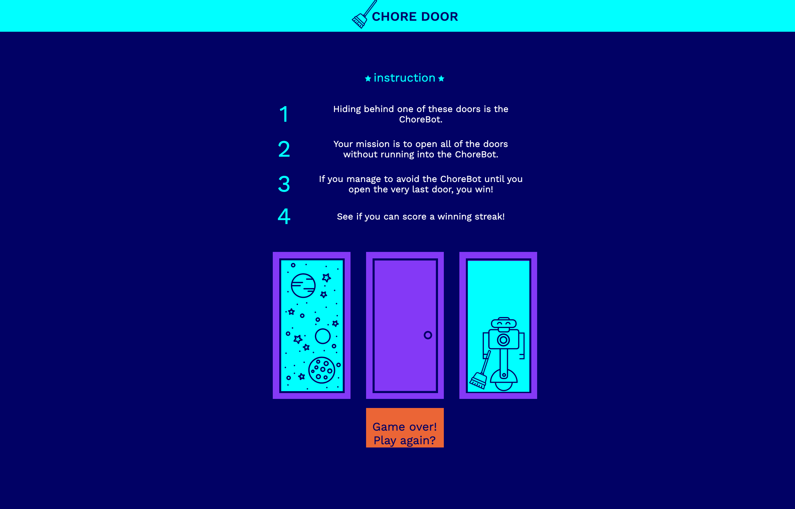

# Chore-Door

## Instructions:
```
1   Hiding behind one of these doors is the ChoreBot.
2	  Your mission is to open all of the doors without running into the ChoreBot.
3	  If you manage to avoid the ChoreBot until you open the very last door, you win!
4	  See if you can score a winning streak!
```

## Screenshot



## Deployed link

[Website](https://yinping-520.github.io/Chore-Door/)

## Repo

[Github](https://github.com/yinping-520/Chore-Door)
